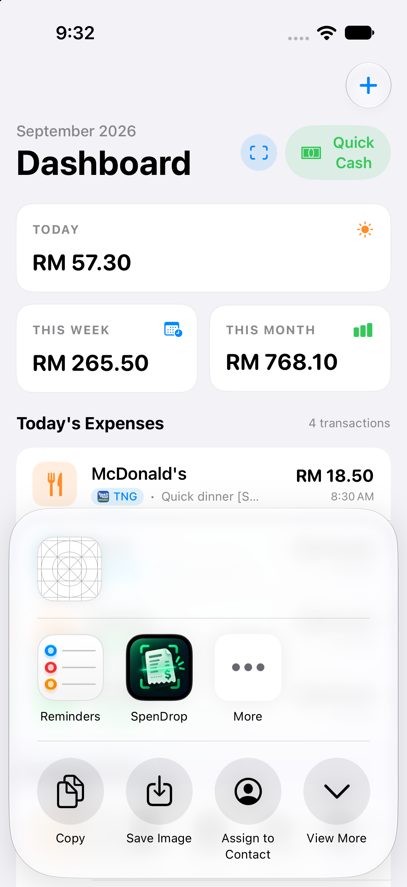
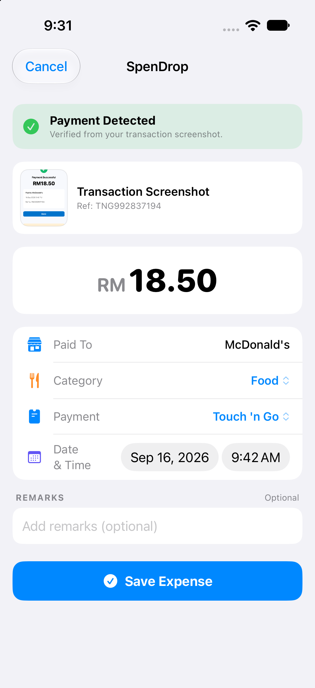
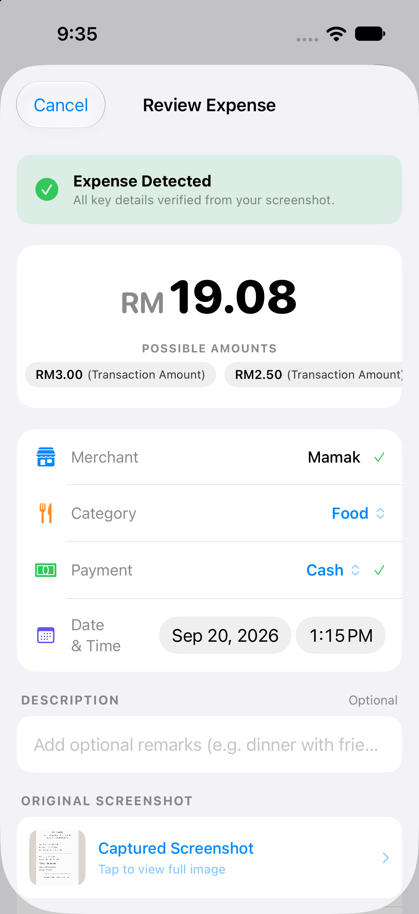
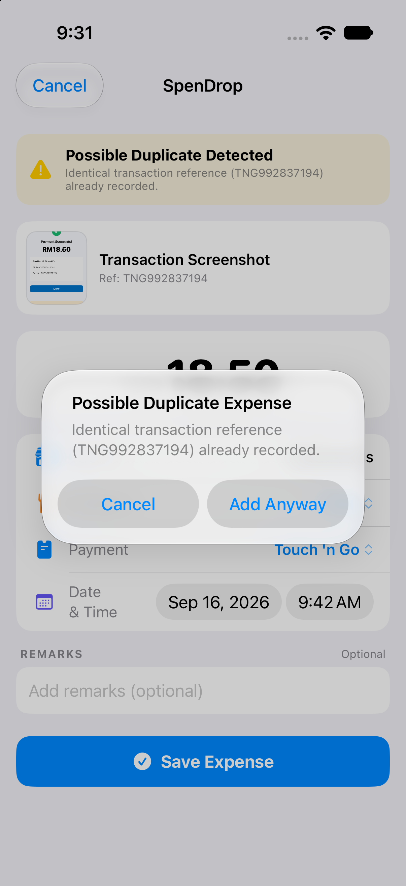
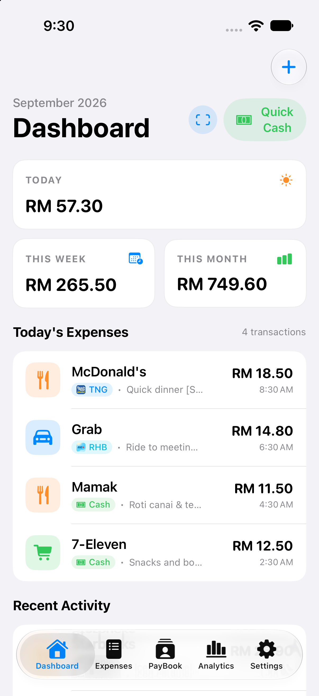
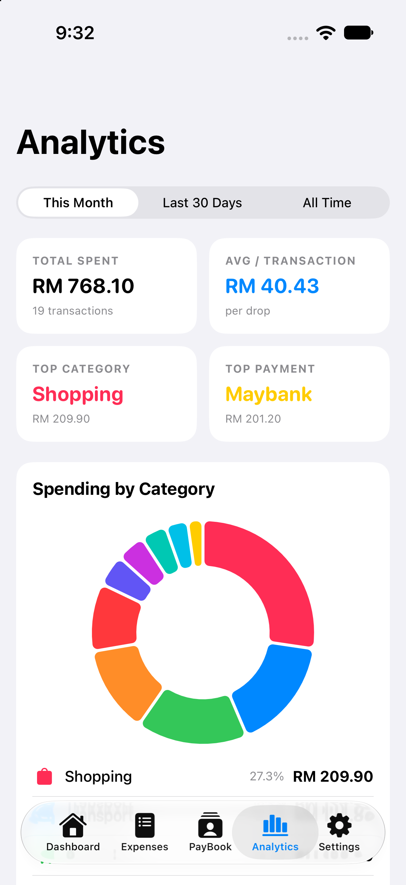
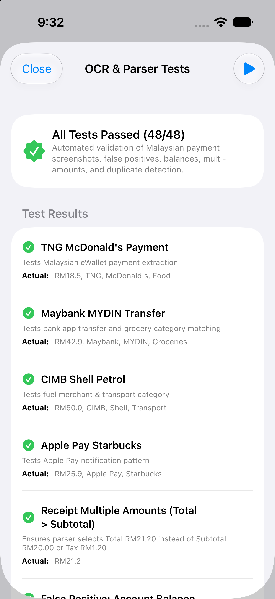
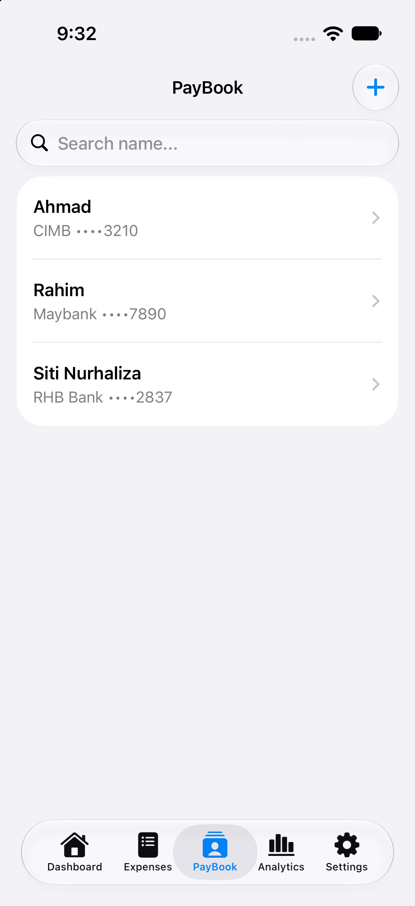
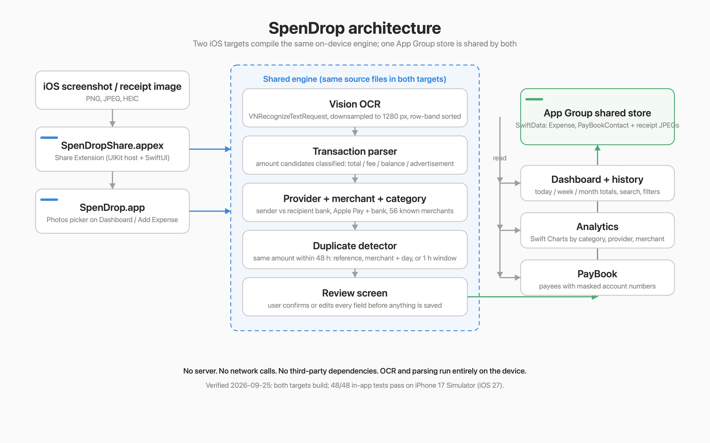

# SpenDrop 💧

**Capture → Understand → Save.** A native, offline-first iOS expense tracker for Malaysian daily spending. Share a payment screenshot to SpenDrop and it becomes a categorised expense, parsed entirely on your iPhone with Apple Vision.

> Full engineering documentation, security review, test evidence and case study: [`docs/SPENDROP_DOCUMENTATION.md`](docs/SPENDROP_DOCUMENTATION.md)

## Overview

Malaysians pay through many apps (Touch 'n Go eWallet, Maybank/MAE, CIMB OCTO, RHB, Public Bank, Bank Islam, GrabPay, Boost, DuitNow QR, Apple Pay) and none of them consolidate confirmations into one ledger. SpenDrop turns the screenshot you already take into a saved expense:

```
Payment done → Screenshot → Share → SpenDrop → auto-parse → confirm → saved
```

- No backend, no cloud, no third-party dependencies, no network code.
- OCR and parsing run on-device (Vision framework + custom rule-based parser).
- Data lives in a SwiftData store inside an App Group shared by the app and its Share Extension.

## Features

- **Screenshot / receipt import** from Photos or the iOS Share Sheet (PNG, JPEG, HEIC).
- **Transaction parser** that extracts amount, merchant, payment provider, category, date/time, reference and status; understands `RM`, `MYR`, Bahasa Malaysia labels, negative notification amounts and multi-amount receipts (prefers Grand Total).
- **False-positive protection**: rejects account balances, credit limits, reward points, advertisement prices, fees, cashback and discounts; flags failed/declined payments.
- **Provider detection** including sender-vs-recipient bank disambiguation in interbank transfers and Apple Pay with its underlying bank.
- **Review before save** with alternative amount candidates, confidence banner and editable fields.
- **Duplicate detection** (same amount within 48 h, matching reference / merchant+day / within 1 h) with "Add Anyway".
- **Quick Cash** manual entry with increment chips and merchant suggestions.
- **Dashboard** (Today / This Week / This Month), **searchable & filterable history**, **Swift Charts analytics** (category donut, payment-source bars, top merchants).
- **PayBook**: payee book with masked account numbers, one-tap copy, search, duplicate-payee alert.
- **Built-in self-test runner**: 48 parser and persistence tests runnable from Settings or via a launch argument.

## Tech Stack

| Layer | Technology |
|---|---|
| Language | Swift (async/await, `@MainActor`) |
| UI | SwiftUI, Swift Charts, PhotosUI; UIKit host for the Share Extension |
| Persistence | SwiftData (`Expense`, `PayBookContact`) in a shared App Group container |
| OCR | Apple Vision `VNRecognizeTextRequest` (`.accurate`, en-US / ms-MY / zh-Hans) |
| Tooling | Xcode 27 (project targets iOS 17.0+), Python script that regenerates `project.pbxproj` |
| Dependencies | None |

## Architecture

```
SpenDrop.app ─────────────┐                  ┌───────────── SpenDropShare.appex
 MainTabView (5 tabs)     │  shared sources  │  ShareViewController → ShareExtensionView
                          ▼                  ▼
   UIImage → OCRService → TransactionParser → ParsedTransaction → DuplicateDetector → Review UI
                 (Vision)   ├ PaymentProviderDetector
                            ├ MerchantDetector / CategoryDetector
                            └ amount classification (MonetaryCandidate)
                          │
                          ▼
   App Group container: SwiftData store · receipt JPEGs · diagnostics log
```

## Project Structure

```
SpenDrop/
├── App/            SpenDropApp.swift (entry, launch-argument hooks, seeding)
├── Models/         Expense, PayBookContact, ExpenseCategory, PaymentSource, ExpenseSourceType
├── Data/           ExpenseDataContainer (App Group store), DuplicateDetector, SampleData
├── OCR/            OCRService, TransactionParser, PaymentProviderDetector, MerchantDetector,
│                   CategoryDetector, MonetaryCandidate, ParsedTransaction, ImageStorageService,
│                   ImagePipelineDiagnostics, TransactionParserTests
├── Views/          Dashboard, Expenses, AddExpense, Review, PayBook, Analytics, Settings
├── ShareExtension/ ShareViewController, ShareExtensionView, Info.plist, entitlements
├── Resources/      Assets (app icon, provider logos), Info.plist, entitlements, diagnostic samples
└── Utils/          CurrencyFormatter, HapticFeedback
scripts/generate_xcodeproj.py   deterministic project generator
docs/                           documentation and screenshots
```

## Installation

1. Requirements: macOS with Xcode 27 (the project was last upgraded with Xcode 27; iOS 17.0 deployment target).
2. Clone the repository and open `SpenDrop.xcodeproj`.
3. In **Signing & Capabilities**, select your team for both targets (`SpenDrop`, `SpenDropShare`). Automatic signing is configured; the App Group `group.com.spendrop.shared` must be available to your team for device builds.

## Environment Variables

None. The app uses no secrets, keys or configuration files.

## Running Locally

- Select the `SpenDrop` scheme and a simulator or device, then **⌘R**.
- Command line:

```bash
xcodebuild -project SpenDrop.xcodeproj -scheme SpenDrop \
  -destination 'platform=iOS Simulator,name=iPhone 17' build
```

- Sample data (18 Malaysian expenses) is seeded on first launch and can be reloaded from **Settings → Load Sample Transactions**.
- To test the Share Extension: take a screenshot of a payment, open it, tap **Share**, choose **SpenDrop**, review, **Save Expense**.

## Database Setup

Nothing to set up. SwiftData creates its store inside the App Group container on first launch. There are no migrations defined.

## API

There is no HTTP API. Internal entry points: `OCRService.recognizeText`, `TransactionParser.parse`, `DuplicateDetector.checkDuplicate`, `ImageStorageService`. Launch arguments:

| Argument | Effect |
|---|---|
| `--run-tests` | run the 48-case suite, print results, exit 0/1 |
| `--run-image-diagnostics` | PNG/JPEG/HEIC pipeline diagnostics |
| `--read-share-logs` | print the Share Extension log from the App Group |
| `--tab <0-4>` | open a tab |
| `--seed-paybook` / `--clear-paybook` | manage sample payees |
| `--open-add` / `--open-detail <name>` / `--open-edit` / `--demo-copied` / `--demo-duplicate` | PayBook UI states |

## Authentication

None. Single-user, on-device app. No accounts, sessions or tokens. The iOS sandbox and App Group entitlement are the only access boundaries.

## Testing

In-app suite (not an XCTest target) with 48 cases covering parsing, provider detection, false positives, duplicates, persistence and PayBook:

- **On device:** Settings → *Run OCR & Parser Self-Test*.
- **From the command line:**

```bash
xcrun simctl launch --console-pty booted com.spendrop.SpenDrop --run-tests
# … [TEST_RUN_SUMMARY] 48/48 PASSED
```

Last verified: 2026-09-25 on iPhone 17 Simulator (iOS 27.0), 48/48 passed.

## Deployment

Local Xcode builds only. No CI/CD, no App Store or TestFlight distribution is configured in this repository. Bundle identifiers: `com.spendrop.SpenDrop` and `com.spendrop.SpenDrop.ShareExtension`.

## Screenshots

All captures are from the iPhone 17 Simulator with synthetic data only. The full set, with captions and how each was produced, is in [`docs/screenshots/case-study/README.md`](docs/screenshots/case-study/README.md).

| Share to SpenDrop | Extension review after OCR | Candidate amounts |
|---|---|---|
|  |  |  |

| Duplicate protection | Dashboard | Analytics |
|---|---|---|
|  |  |  |

| On-device tests | PayBook | Architecture |
|---|---|---|
|  |  |  |

## Known Limitations

- Currency preference in Settings is stored but not applied (all amounts are RM).
- Camera capture is not implemented (usage string exists).
- Deleting an expense does not delete its stored receipt image.
- Persistence errors are swallowed with `try?`; the extension diagnostics log is unbounded.
- PayBook account numbers are stored in plain text and copied to the general pasteboard without expiry.
- Parser is keyword-based; unfamiliar layouts fall back to "Unknown" with low confidence. Column-aligned receipts can split a label from its amount in OCR, so the total may lose priority (the review screen then shows "Possible Expense Detected").
- iPhone only, portrait only, English UI only. No schema migration plan.

## Future Improvements

Shared framework/Swift package for the engine · XCTest target and GitHub Actions CI · handled save errors · debug-only, rotated logging · expiring pasteboard and optional Face ID for PayBook · receipt cleanup on delete · schema versioning · apply currency setting · camera capture · Bahasa Malaysia localisation.

## Project Status

Actively developed. Milestones 1–3 (core tracker, OCR/parser, Share Extension) and PayBook V1 are complete. Version 1.3.0. Not released. Fully named SpenDrop with automatic migration for legacy installs. The bundled diagnostic sample images are synthetic.

## License

No license file is present in the repository. All rights reserved by the author unless a license is added.
