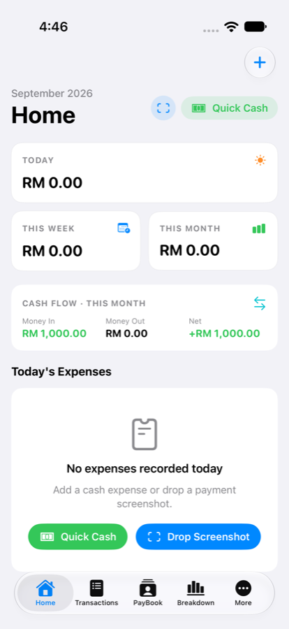
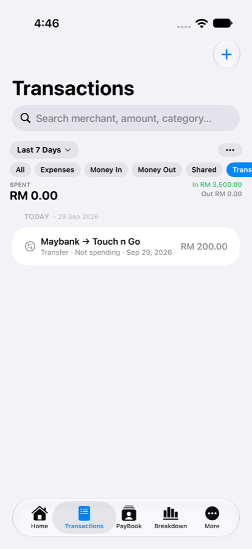
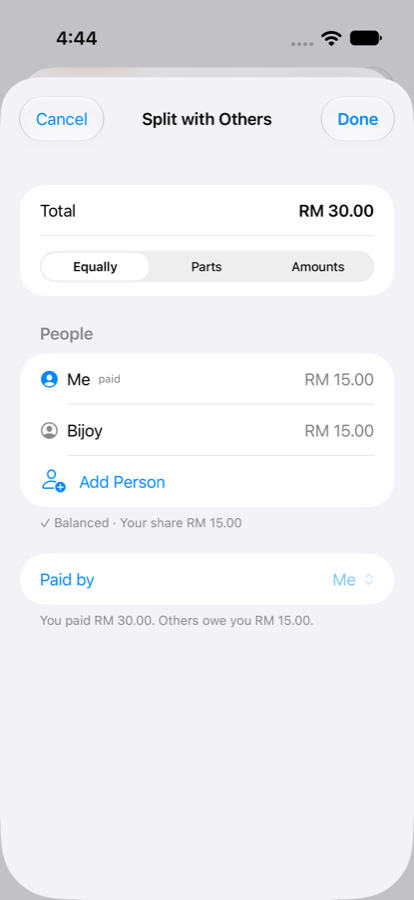
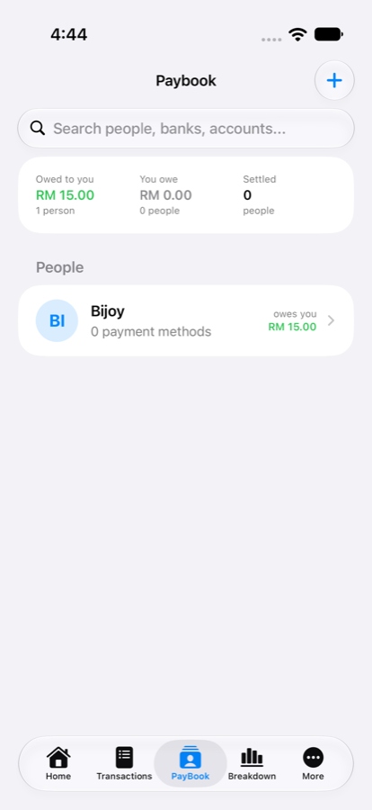
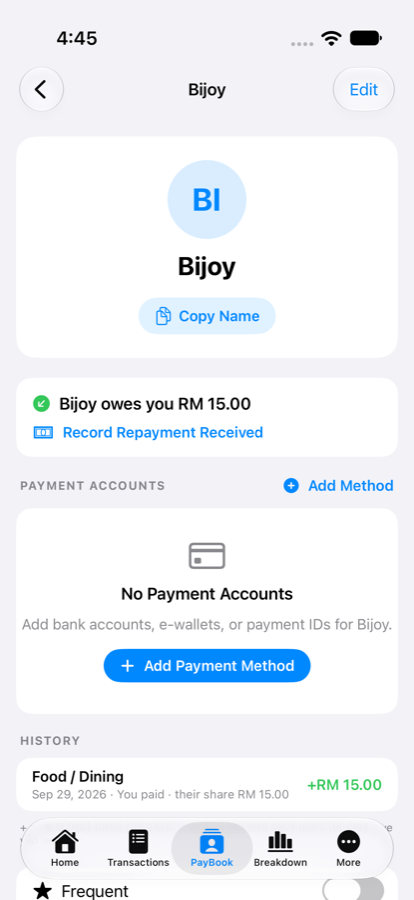
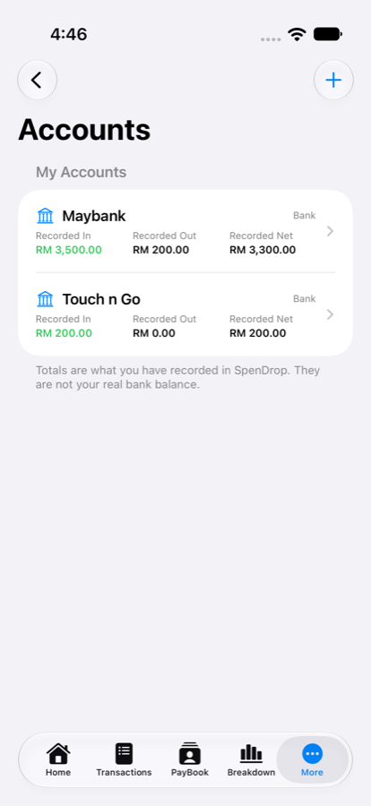
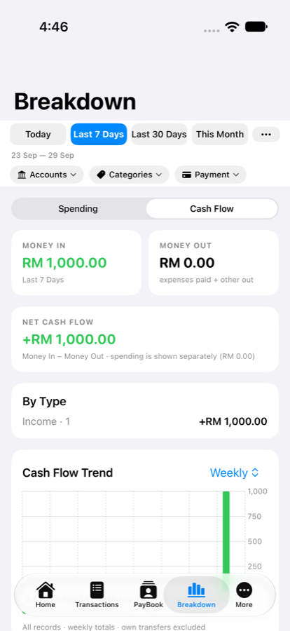
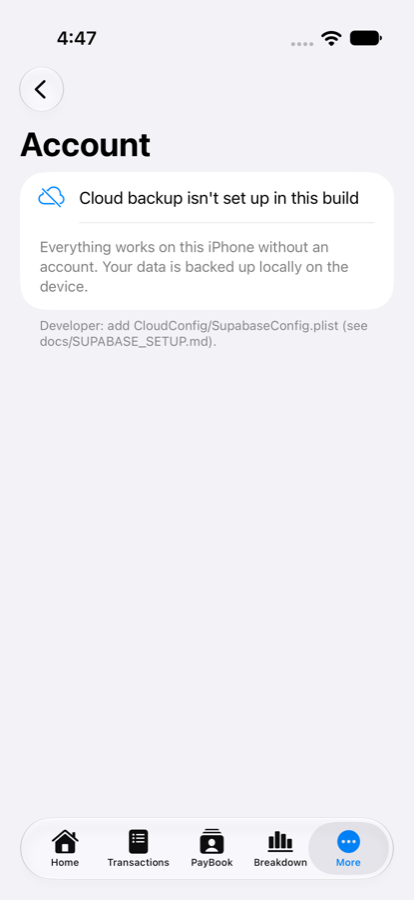

# SpenDrop 💧

**Capture → Understand → Save.** A native, local-first iOS expense tracker for Malaysian daily spending. Share a payment screenshot to SpenDrop and it becomes a categorised expense, parsed entirely on your iPhone with Apple Vision. Shared bills, loans, money in/out and cash flow are optional layers on top — normal expense entry stays one screen.

> Full engineering documentation, security review, test evidence and case study: [`docs/SPENDROP_DOCUMENTATION.md`](docs/SPENDROP_DOCUMENTATION.md)
> Optional account & cloud backup setup: [`docs/SUPABASE_SETUP.md`](docs/SUPABASE_SETUP.md)

## Overview

Malaysians pay through many apps (Touch 'n Go eWallet, Maybank/MAE, CIMB OCTO, RHB, Public Bank, Bank Islam, GrabPay, Boost, DuitNow QR, Apple Pay) and none of them consolidate confirmations into one ledger. SpenDrop turns the screenshot you already take into a saved record:

```
Payment done → Screenshot → Share → SpenDrop → auto-parse → confirm → saved
```

- **Local-first.** SwiftData on the device is the source of truth; everything works offline and without an account.
- OCR and parsing run on-device (Vision + a custom rule-based parser). No paid or AI services.
- Optional sign-in (Google or email) adds cloud **backup** on the Supabase free tier. It never replaces local data.

## Core ideas (the financial model)

| Concept | Answers | Rule |
|---|---|---|
| **Expense** | "What did I spend on?" | `amount` is always the full bill |
| **Spending** | "How much did I spend?" | full amount if I paid; my share if someone else paid |
| **Money In / Money Out** | "What came in / went out that isn't spending?" | income, refunds, loans, repayments; own-account transfers excluded |
| **Net cash flow** | "What happened to my cash?" | Money In − Money Out (expenses I paid count as Money Out) |
| **Person balance** | "Who owes whom?" | always calculated; + they owe me, − I owe them |

All new money maths uses integer sen (never floating point). Splits always add up exactly.

## Features

**Capture**
- Screenshot / receipt import from Photos or the iOS Share Sheet (PNG, JPEG, HEIC).
- Parser extracts amount, merchant, provider, category, date/time, reference, status; understands `RM`/`MYR`, Bahasa Malaysia labels, negative amounts, multi-amount receipts; rejects balances, credit limits, points, ads, fees and cashback.
- Suggests **Money In / refund / top-up** only from clear wording ("you have received", "refund", "reload"); you confirm on the review screen.
- **Learned categories:** your saves and corrections teach SpenDrop (on-device) which category a merchant belongs to.
- Duplicate protection for expenses and money records — always a warning, never a silent delete.
- **Apple Pay automation:** a Shortcuts action ("Log Apple Pay Purchase") for the Wallet *Transaction* automation.

**Track**
- **Home:** Today / This Week / This Month spending; Cash Flow and Balances cards appear only when relevant.
- **Transactions:** one timeline of expenses, Money In, Money Out and transfers with filters (All · Expenses · Money In · Money Out · Shared · Transfers). "Spent" is always shown separately from In/Out.
- **Split with others:** Equally, by Parts, or exact Amounts; Paid by me or someone else; "Same as last time".
- **PayBook:** people and their payment details, who owes you / who you owe, history, Record Repayment, Frequent / Archived people, delete blocked while money is owed.
- **Accounts** (More → Accounts): recorded in / out / net per account (not a bank balance), rename, archive.
- **Breakdown:** Spending | Cash Flow — categories, channels, accounts, top merchants, my share, refunds and net spending, daily/weekly/monthly trends.

**Safety**
- The database is never deleted on failure (safe mode); a copy is taken before every schema upgrade.
- Automatic local backups with dated history; JSON export/import; versioned backup format (formats 1–3 supported).
- Optional cloud backup: append-only, per device; restore merges by record id after a local safety copy.

## Screenshots

Simulator captures from the automated UI tests (synthetic data only). Older captures: [`docs/screenshots/`](docs/screenshots).

| Home | Transactions | Split with others | PayBook |
|---|---|---|---|
|  |  |  |  |

| Person balance | Accounts | Breakdown: Cash Flow | Account (optional) |
|---|---|---|---|
|  |  |  |  |

## Tech Stack

| Layer | Technology |
|---|---|
| Language | Swift 5 mode (async/await, `@MainActor`, `@Observable`) |
| UI | SwiftUI, Swift Charts, PhotosUI; UIKit host for the Share Extension |
| Persistence | SwiftData with explicit `VersionedSchema` V1 → V2 → V3 and a `SchemaMigrationPlan`, in a shared App Group container |
| OCR | Apple Vision `VNRecognizeTextRequest` (on-device) |
| Automation | App Intents (Shortcuts Wallet automation) |
| Accounts & cloud (optional) | Supabase Auth + Storage + Postgres (Row Level Security) via its official HTTPS API; Google sign-in with OAuth PKCE in `ASWebAuthenticationSession`; session in the Keychain |
| Tooling | Xcode 27 (iOS 17.0+ target), Python script that regenerates `project.pbxproj` |
| Third-party packages | None |

## Architecture

```
SpenDrop.app ────────────────────┐               ┌──────────── SpenDropShare.appex
 Home | Transactions | PayBook |  │ shared model  │  ShareViewController → ShareExtensionView
 Breakdown | More                 │ + engine code │  (Save as Expense / Money In / Money Out)
                                  ▼               ▼
 UIImage → OCRService → TransactionParser → ParsedTransaction → classify → duplicate check → review → save
                                                                                      │
                                     ┌────────────────────────────────────────────────┴──────┐
                                     ▼                                                        ▼
                         Expense (+ ExpenseShare)                                     MoneyMovement
                                     │     Account · PayBookProfile · ClassificationRule
                                     ▼
                FinancialCalculator / PersonLedger / ActivityFeed (calculated, never stored)
                                     ▼
                Home · Transactions · PayBook · Breakdown · Accounts

 App Group container: SwiftData store · receipts · local backups + history · pre-upgrade copies
 Optional: CloudBackupService ──HTTPS──► Supabase (auth, private bucket, backups table, RLS)
```

## Project Structure

```
SpenDrop/
├── App/            SpenDropApp (entry, lifecycle backups, test launch flags), ApplePayIntent
├── Models/         Expense, ExpenseShare, MoneyMovement, Account, PayBookProfile, PayBookPaymentMethod,
│                   ClassificationRule, legacy PayBookContact, enums (category, source, channel)
├── Data/           ExpenseDataContainer (safe open, pre-upgrade copies), SchemaVersions (V1–V3),
│                   UserDataBackupService, AccountLinker, Money, SplitCalculator, SplitDraft,
│                   FinancialCalculator, PersonLedger, ActivityFeed, PeriodGrouping,
│                   TransactionClassifier, MovementDuplicateDetector, ApplePayAutomation,
│                   TransactionFilterEngine, DuplicateDetector, TransactionReconciliationEngine
│   ├── Cloud/      CloudCore (config, errors, HTTP, Keychain), AuthService, CloudBackupService
│   └── Tests/      in-app test suites (see Testing)
├── OCR/            OCRService, TransactionParser, DirectionDetector, provider/merchant/category detectors
├── Views/          Dashboard (Home), Expenses (Transactions), PayBook, Analytics (Breakdown), More,
│                   Accounts, Account, Money, Split, AddExpense, Review, Settings
├── ShareExtension/ ShareViewController, ShareExtensionView
└── Resources/      Assets, Info.plist, entitlements, CloudConfig/ (config template), diagnostic samples
SpenDropUITests/    XCUITest flows (run with the SpenDropUITests scheme)
supabase/           SQL for the optional cloud backend
scripts/            deterministic Xcode project generator
docs/               documentation, setup guide, screenshots
```

## Installation

1. Requirements: macOS with Xcode 27; iOS 17.0+ deployment target.
2. Clone the repository and open `SpenDrop.xcodeproj`.
3. In **Signing & Capabilities**, select your team for `SpenDrop` and `SpenDropShare`. The App Group `group.com.spendrop.shared` must be available to your team for device builds.

## Configuration

Nothing is required. Cloud backup is optional: copy `SpenDrop/Resources/CloudConfig/SupabaseConfig.example.plist` to `SupabaseConfig.plist` (git-ignored) and follow [`docs/SUPABASE_SETUP.md`](docs/SUPABASE_SETUP.md). Only the public anon key goes in the app, never a service-role key.

## Running Locally

- Select the `SpenDrop` scheme and a simulator or device, then **⌘R**.
- Command line:

```bash
xcodebuild -project SpenDrop.xcodeproj -scheme SpenDrop \
  -destination 'platform=iOS Simulator,name=iPhone 17' build
```

- To test the Share Extension: open a payment screenshot in Photos → **Share** → **SpenDrop** → review → save.

## Database

SwiftData creates the store in the App Group container on first launch. The schema is explicitly versioned:

| Version | Adds | Upgrade step |
|---|---|---|
| V1 | Expense and PayBook models (frozen copy of the original) | — |
| V2 | Account, ExpenseShare, MoneyMovement; payer/split/account on Expense; isFrequent/isArchived on people | creates one Account per funding account and links expenses |
| V3 | ClassificationRule | adds the table only |

Before any upgrade a copy of the store is saved in `SpenDropSafety/`; if a store can't be opened the app enters safe mode and leaves it untouched.

## Launch Arguments

| Argument | Effect |
|---|---|
| `--run-all-tests` | run every in-app suite, print per-suite results, exit 0/1 |
| `--run-tests`, `--run-data-safety-tests`, `--run-financial-tests`, `--run-account-tests`, `--run-split-tests`, `--run-people-tests`, `--run-timeline-tests`, `--run-phase7-tests`, `--run-hardening-tests`, `--run-auth-tests`, `--run-cloud-tests` | run one suite |
| `--print-schema-fingerprints` | print the V1/V2/current schema fingerprints |
| `--ui-testing` | fresh temporary database, no seeding, no backup writes (used by UI tests) |
| `--run-image-diagnostics`, `--read-share-logs`, `--tab <0-4>`, PayBook demo flags | diagnostics and demos |

## Authentication (optional)

Local use needs no account. More → Account offers **Continue with Google**, **Create Account** and **Sign In** (email/password) through Supabase Auth. Sessions are stored in the Keychain; passwords are never stored by SpenDrop. Signing out or deleting the cloud account never deletes data on the iPhone.

## Testing

In-app suites run on in-memory stores or temporary folders only (a final isolation check proves the real database was never opened):

```bash
xcrun simctl launch --console-pty booted com.spendrop.SpenDrop --run-all-tests
# [SUITE_SUMMARY] Existing: 93/93 PASSED … Test isolation: 1/1 PASSED
```

| Suite | Checks |
|---|---|
| Existing (parser, providers, real samples, filters, PayBook, backup, share flow) | 93 |
| Data safety (safe mode, pre-upgrade copies, frozen schemas, backups, import identity) | 18 |
| Financial models (money, splits, accounts, migration, backup format) | 46 |
| Accounts / Money In & Out | 10 |
| Shared expenses | 15 |
| PayBook balances | 11 |
| Unified timeline | 12 |
| Automation, learned rules, parser direction, V2 → V3 migration | 14 |
| Hardening (V1 → V3 chain, full backup round trip, edge cases) | 6 |
| Authentication (simulated Supabase server) | 14 |
| Cloud backup and restore (simulated Supabase server) | 13 |
| Test isolation | 1 |
| **Total** | **274** |

UI tests: choose the **SpenDropUITests** scheme and press **⌘U** (6 flows: tabs, expense, split + PayBook balance, accounts + Money In + transfer, Home/Breakdown cash flow, Account screen).

Last verified 2026-09-29 on the iOS 27 simulator: 274/274 in-app checks and 6/6 UI tests passed; app and Share Extension build. Version 1.4.0 has not yet been verified on a physical iPhone.

## Deployment

Local Xcode builds only. No CI/CD or App Store/TestFlight distribution is configured. Bundle identifiers: `com.spendrop.SpenDrop`, `com.spendrop.SpenDrop.ShareExtension`.

## Known Limitations

- Account totals are *recorded* activity, not live bank balances (bank connections are intentionally out of scope).
- Sign-in and cloud backup were tested against a simulated server; configure Supabase and follow the setup checklist to verify end to end.
- Apple Pay automation only sees Apple Pay taps made through Wallet; bank-app, QR and other notifications can't be read by iOS apps.
- Cloud backups are protected by HTTPS, authentication and Row Level Security, but are not end-to-end encrypted.
- Receipt images are not included in backups; deleting an expense leaves its image file.
- iPhone only, portrait only, English UI; the currency preference is stored but amounts are RM.

## Project Status

Version **1.4.0** (Shared Money & Cloud Backup). Actively developed, not released.

## License

No license file is present in the repository. All rights reserved by the author unless a license is added.
